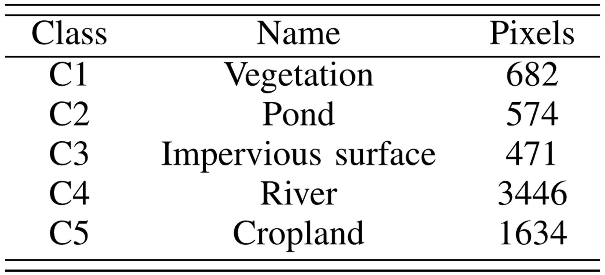

#### ZY1-02D-HongHu | ZiYuan-1 (02D) [ZY-1(02D)] | HSI dataset
---
## ZY1-02D-HongHu Dataset for hyperspectral image (HSI) classification
---

 
 

Fig. 1. ZY1-02D-HongHu dataset. (a) False color composition. (b) Ground truth.
  

 

Fig. 2. Class labels in ZY1-02D-HongHu dataset.

## Introduction

ZY1-02D-HongHu dataset is our newly released HSI. The HSI was acquired by the hyperspectral imager on the ZiYuan-1 (02D) [ZY-1(02D)] satellite (on May 24, 2021), over a rural-urban fringe area in Honghu, Jingzhou, Hubei Province. It contains 166 spectral bands from 400-2500 nm and 119×374 pixels with a spatial resolution of 30 m. We labeled 6807 pixels in this dataset into 5 classes: Vegetation, Pond, Impervious surface, River and Cropland. As it can be seen from the false color image, this scene is characterized by a large number of spatially fragmented land cover regions. The challenge is to capture the exact boundaries of the land cover areas.

## Citation

If you use this dataset in your research, we would appreciate your citation to the following paper:

	@ARTICLE{yu2024dSPG,
	  author={Yu, Long and Li, Jun and He, Lin and Plaza, Antonio and Wang, Lizhe and Tang, Zhonghui and Zhuo, Li and Yuan, Yuchen},
	  journal={IEEE Transactions on Geoscience and Remote Sensing}, 
	  title={dSPG: A New Discriminant Superpixel Graph Regularizer and Convolutional Network for Hyperspectral Image Classification}, 
	  year={2024},
	  volume={62},
	  number={},
	  pages={1-18},
	  doi={10.1109/TGRS.2024.3439434}}

	@article{Yu2024CIDA,
	  title={Class-independent domain adaptation for hyperspectral image classification},
	  author={Yu, Long and Li, Jun and He, Lin and li, Yunfei},
	  journal={National Remote Sensing Bulletin},
	  volume={28},
	  number={3},
	  pages={610-623},
	  year={2024},
	  doi={10.11834/jrs.20232512}
	}
 
	@article{Yu2024CIDA,
	  title={高光谱图像类别独立的域适应分类},
	  author={余龙 and 李军 and 贺霖 and 李云飞},
	  journal={遥感学报},
	  volume={28},
	  number={3},
	  pages={610-623},
	  year={2024},
	  doi={10.11834/jrs.20232512},
	  language={ch},
	}
